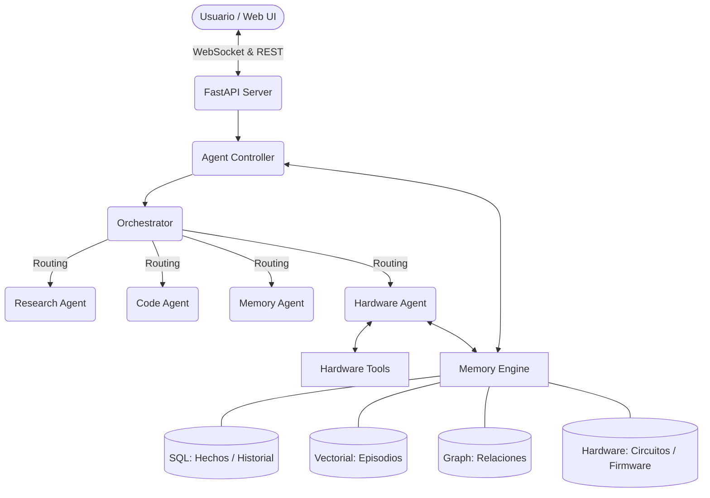

# Stratum - Hardware Memory Engine: Unified Knowledge Base & Technical Context

Este documento constituye la Base de Conocimiento (Knowledge Base) integral de **Stratum**. Ha sido redactada desde la perspectiva de un Arquitecto de Software Senior para servir como contexto absoluto y excluyente a futuros Agentes de Inteligencia Artificial que deban escalar, mantener o debuggear la plataforma.

---

## 1. Visión General y Propósito
**Stratum** es un *"Agentic Operating System"* (Sistema Operativo basado en Agentes) especializado en el control biomimético de la memoria y la interacción conversacional continua para el manejo nativo de hardware (microcontroladores como Arduino, ESP32, Raspberry Pi Pico).
- **Problema central:** Soluciona la amnesia en los LLMs conversacionales al momento de programar hardware de forma prolongada, donde los modelos "olvidan" los detalles topológicos de los circuitos (qué sensores hay, en qué pines, por qué fallaron) a medida que la sesión avanza.
- **Valor aportado:** Introduce un robusto Motor de Triple-Memoria (SQL, Vectorial, Grafo) orquestado junto a herramientas autónomas capaces de generar firmware C++, compilarlo en el entorno de host del usuario (usando `arduino-cli`), flashearlo y debuggearlo (al leer interactuando con el monitor Serial). Proactivamente inyecta el "Contexto del Circuito" almacenado antes de la escritura de código, logrando generar rutinas precisas para la electrónica conectada.

---

## 2. Stack Tecnológico y Dependencias
El proyecto es un monolito en Python altamente asíncrono, con interfaces REST y WebSockets para la capa de presentación.

- **Lenguaje Principal:** Python 3.10+
- **Framework Web:** `FastAPI` + `Uvicorn`. Se eligió por su soporte nativo `asyncio`, siendo de carácter vital para soportar y mantener flujos de datos bidireccionales concurrentes (ej., streaming de respuestas LLM en `/ws/chat` en paralelo con envío intensivo de tramas de telemetría de osciloscopio en `/ws/signal`).
- **Infraestructura Machine Learning:** Capacidad Local-First utilizando `Ollama` (despachando modelos derivados de `qwen2.5`) encadenado mediante el ecosistema `@aethermind`.
  - `@aethermind/proxy`: Proxy en Node.js puerto `11435` que intercepta todo tráfico natural a `11434` (Ollama) inyectando headers transaccionales para dashboards remotos (`X-Client-Token`).
- **Triple-Memory Storage:**
  - `SQLite`: Persistencia tradicional tabular y rápida (Metadatos e historial linear).
  - `Qdrant` (Local) + `Sentence Transformers` (`all-MiniLM-L6-v2`): Embeddings semánticos para memorias episódicas.
  - `NetworkX`: Grafo dirigido guardado recursivamente como JSON en disco.
- **Herramientas Hardware:** `arduino-cli` (gestión de boards y cores), `pyserial` (I/O transparente y mitigación de bloqueos de OS sobre los puertos serie).

---

## 3. Arquitectura de Directorios e Infraestructura
Diferenciación estricta usando un patrón modular "Agente - Lógica - Memoria".

- `/api/`: Capa de transporte y HTTP. Aloja `server.py` y el frontend vainilla integrado en `/static/`.
- `/core/`: Configuración maestra y parseo de `.env` (`config.py`) junto al logger central (`logger.py`).
- `/agent/`: Inteligencia Artificial y Control Asíncrono.
  - `agent_controller.py`: Corazón del loop conversacional y manejador de la ingesta en memoria a corto plazo.
  - `orchestrator.py`: LLM-router de entrada. Escoge especialistas.
  - `/agents/`: Submódulos implementadores (`hardware_agent.py` para electrónica, `code_agent.py` para script safe, `research_agent.py` web-scraping y `memory_agent.py`).
- `/memory/`: Abstracciones neuronales de almacenamiento libre.
  - `vector_memory.py`, `graph_memory.py`.
  - `fact_extractor.py`: Analizador que chupa y destila el texto bruto del usuario convirtiéndolo a Json tipado para inyectar en las DBs.
  - `memory_consolidator.py`: Cronjob "On-Exit" (simulando los ciclos de sueño) que fusiona y colapsa contradicciones entre hechos antiguos y nuevos.
- `/database/`: Implementación de drivers de persistencia (`sql_memory.py`, `hardware_memory.py`).
- `/tools/`: Funciones aisladas de efecto secundario puro (`hardware_detector.py`, `serial_monitor.py`, `signal_reader.py`, `firmware_flasher.py`).

---

## 4. Flujo de Datos y Lógica de Control (El "Hardware Happy Path")
Describe el ciclo de vida de un request donde el usuario instruye cambiar el estado del espacio físico a través de una placa conectada:

1. **Recepción:** El usuario envía instrucción natural vía **WebSocket** a `server.py` (`/ws/chat`). 
2. **Entrada y Extracción:** `AgentController.process_input()` toma el string, lo asienta en la ShortMemory. Exige a `fact_extractor()` y `graph_extractor()` correr los clasificadores contra el texto en busca de *Hechos Relevantes* que asentar transaccionalmente como identidad antes de responder.
3. **Pivote (Enrutamiento):** Entra en `Orchestrator.run()`. Mediante *keywords* crudos o prompting rápido, se selecciona el Agente Especializado en esta topología; el `hardware`.
4. **Razonamiento Especializado:** `HardwareAgent.run()` vuelve a invocar un clasificador menor (LLM) o fallback local para determinar el *Intent* directo (`query`, `program`, `signal`, `debug`).
5. **Ejecución de Comando C++ (`program` intent):**
   - Llama a la herramienta `detect_devices()` de `/tools/` atrapando puertos como COM3/ttyUSB0 y la arquitectura (`fqbn`).
   - Pide a la DB SQLite `HardwareMemory` recuperar la estructura JSON del **Contexto del Circuito** (`format_circuit_for_prompt()`), concatenándolo internamente al request del usuario. 
   - Llama a la función `generate_firmware()` emitiendo un prompt al LLM para escribir exactamente archivo `.ino`/`.cpp`.
   - Se procesa en `compile_firmware()`, montando una carpeta `/agent_files/firmware/` y compilando binario asincronamente.
   - Sube a la placa electrónica mediante `flash_firmware()`, leyendo durante 5 segundos su salida cruda (`read_serial()`).
6. **Asentamiento Mutante (Persistencia):** El snapshot del circuito, el feedback final y la traza serial se guardan en la DB `hardware_memory.py` y se anexa un chunk narrado en _Vectores_ en base a la historia del agente ("Hoy logré prender el motor C").
7. **Respuesta Terminal:** `AgentController` sube el resultado y emite sus tokens `_stream_final_response()` al usuario por WebSocket.

---

## 5. Puntos de Integración (APIs / Servicios / DBs)
- **Ollama Loopback Proxy:** `http://localhost:11435`. Interceptador nodeJS base de la IA.
- **SQLite (memory.db):** Dos ejes: `conversations`/`facts` (Identidad), y `circuit_context`/`project_library` (Metadatos robustos y código útil de placas C++).
- **Qdrant (Local binario):** Directorio `/memory_db/` (ChromaDB architecture alike). 
- **GraphDB JSON:** `/database/graph_memory.json` (Almacenamiento del NetworkX en disco como grafo de nodos).

---

## 6. Estado Actual y Deuda Técnica
**Completado (Full Operacional):**
- Infraestructura del Triple-Memory Engine asíncrono.
- Compilación e interacción nativa por Arduino-CLI sin congelamiento de entorno host (Windows/Linux/Mac). 
- Inyección "Zero-Shot" topológica: El código compila sin errar en qué pines están qué relés al alimentarse del contexto físico en la DB temporal en los loops de Bug-fix e Invocación.
- Soporte a Streaming WebSockets (gráfico serial temporal).

**Falta Implementar (TODOs):**
- Instanciador Automático de Dependencias Externas C++: Si el modelo de IA responde `#include <FastLED.h>` el `CLI` crashea si host_OS no la preinstaló, requiriendo validación contra la salida del compilador.
- Batería de `PyTest` mediante *Mocks* estancos del Serial (que envíen bytes dummies por el puerto).

**Code Smells y Cuellos de botella:**
- **Calls síncronas LLM en thread bloqueante:** Usar `requests.post()` sin await/async dentro de los métodos de Agentes y del Orquestador asfixiará los _workers_ Uvicorn en carga concurrente de multiples usuarios (Se recomienda refactorizar todo agente local a capa HTTP async usando `httpx`).

---

## 7. Instrucciones para el Siguiente Agente de IA (Developer Context Rules)
Al continuar operando, programando o parcheando Stratum, cumples de manera irrefutable los siguientes guidelines de diseño:

1. **Imports Absolutos Base:** Stratum se ejecuta desde `c:/.../ai-memory-engine/`. Cualquier inserción de directiva Python debe ser **Path absoluto relativo al root** (`from core.config import ...`, `from database.hardware_memory import ...`).
2. **Context Managers Mandatorios:** Las bases SQL (`SQLite`) de este proyecto están activamente atacadas por hilos paralelos (extracción, rutinas websockets). **Nunca alteres una consulta de escritura si no la envuelves en un `with self._get_connection() as conn`.**
3. **Prompts Deterministas:** Si editas el sistema de Extracción LLM (clases `*_extractor.py` o `Orchestrator`), asume que los parseadores intermedios son frágiles. Reitera estrictamente en el prompt la generación limpia del JSON sin *"backticks"* de Markdown, ya que `json.loads` debe procesarlo en crudo.
4. **Prioriza Heurísticas Estáticas (Zero-LLM):** Las latencias se comen la vida del sistema. Si precisas generar un clasificador para una nueva sub-feature en `agent_controller.py`, haz que tu agente primero se pregunte si puede resolver el *routing* a través de listas de strings (Keywords primitivos, ej: *Orchestrator._keyword_route*), antes de someter a un overhead con _llama_.
5. No toques la estructura ni variable ambiental `.env` referida al *puerto 11435* (`OLLAMA_BASE_URL`), su bypass telemetral externo es vital.
